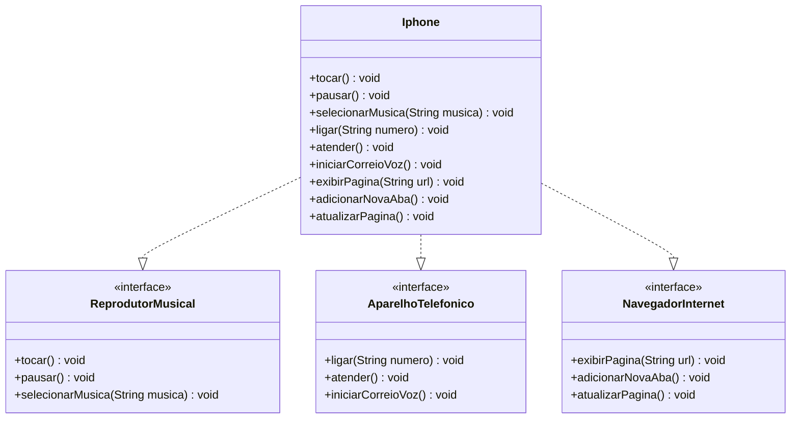

# DIO - Desafio Modelagem e Diagramação do Componente iPhone

Este repositório contém a resolução do desafio de POO da DIO, modelando o lançamento do iPhone de 2007 com suas três características principais: Reprodutor Musical, Aparelho Telefônico e Navegador na Internet.

## Diagrama UML (Mermaid)

## Como Executar

1. Compile os arquivos Java localizados em `src/`.
2. Execute a classe `App.java` para ver a simulação dos métodos no console.